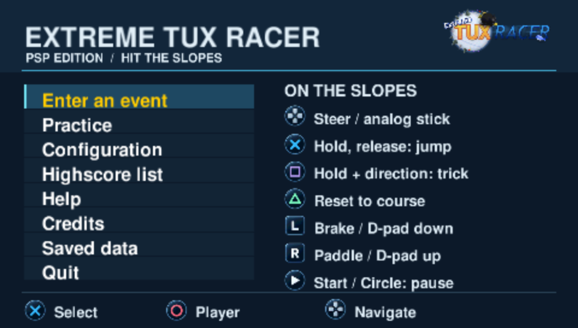

# Extreme Tux Racer for PSP

An unofficial PSP port of [Extreme Tux Racer](https://sourceforge.net/projects/extremetuxracer/), based on version 0.8.4. Race Tux down snowy mountains, collect fish, and beat the clock.


Tested in PPSSPP at 333 MHz. Real PSP compatibility is still under investigation: a shutdown during loading was reported for v0.5.0. See the [hardware status](docs/startup-validation.md#v050-physical-shutdown-report).

## Play

Download the game ZIP from the [latest release](https://github.com/chriopter/psp-tuxracer/releases/latest). Extract it and copy `PSP/GAME/ExtremeTuxRacer/` to your PSP's memory stick, or open its `EBOOT.PBP` in PPSSPP. Keep `data/` and `config/` alongside the executable.

| Control | Action |
| --- | --- |
| D-pad / analog stick | Steer and navigate |
| Up / R | Paddle |
| Down / L | Brake |
| Cross | Hold and release to jump / confirm |
| Circle | Back / pause race / resume from pause |
| Square + direction | Trick |
| Triangle | Reset to the course |
| Start | Pause / resume |

Start, Square, Triangle and the shoulder buttons do not activate menu items.
To leave a race, pause, select **End race**, then confirm with Cross (Circle cancels).
Quitting the game also requires confirmation. The main menu shows the PSP button legend.



See the [screenshot and performance checks](docs/psp-ui-validation.md) and the [generated icon artwork and prompt](docs/artwork/psp-controls.md).

Progress and settings save automatically. The **Saved data** menu opens the PSP Save/Load dialogs.

## Build

Requires Docker, Python 3, FFmpeg, ImageMagick, and PPSSPP (`PPSSPPSDL`).

```sh
./build-extremetuxracer.sh
./start-extremetuxracer.sh
```

The build uses a pinned PSP SDK container. The launcher prepares the complete game data automatically after a rebuild, preserving saves and settings. Set `PPSSPP_BIN` if your emulator is installed elsewhere.

## Development

The history has three steps: import original 0.8.4, move it into `ports/extremetuxracer/`, then port it to PSP. See [source provenance and updates](docs/upstream.md) and [porting notes](docs/porting.md).

[Build and test details](docs/development.md) · [Hardware testing](docs/hardware-validation.md) · [Release packaging](docs/binary-distribution.md)

## Credits and license

Original game by the [Extreme Tux Racer team](ports/extremetuxracer/AUTHORS) and its contributors. This port is not affiliated with the original team or Sony.

Game code and assets: **GPL-2.0-or-later**, with a separate permissive license for the quadtree implementation. See [LICENSE](LICENSE), [license details](docs/licensing.md), and [source provenance](docs/upstream.json).
