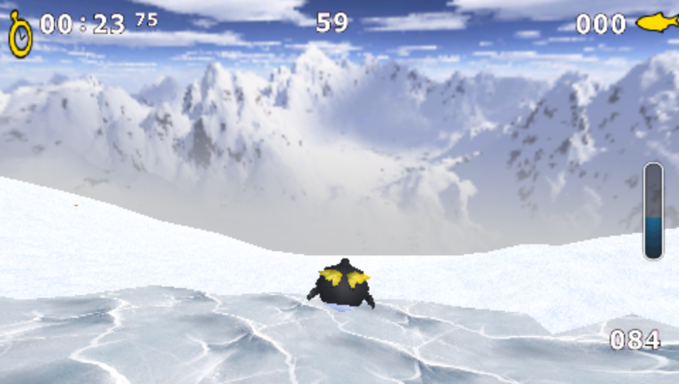

# Extreme Tux Racer for PSP

An unofficial PSP homebrew port of **Extreme Tux Racer 0.8.4**, based on the official C++ PC sources. Tested in **PPSSPP 1.20.4 at 333 MHz**, at native PSP resolution with music enabled. This codebase replaces the earlier Tux Racer 0.61 experiment.



## CI downloads

[](https://github.com/chriopter/tuxracer-psp/actions/workflows/psp.yml)

Go to **Actions → PSP build → a successful run → Artifacts** to download the complete package: the game ZIP, corresponding sources, and checksums. The ZIP contains `PSP/GAME/ExtremeTuxRacer/`, which you can copy to your PSP or open in PPSSPP. Tags matching `v*` also create a [release](https://github.com/chriopter/tuxracer-psp/releases).

CI builds and tests every push to `main`; artifacts remain available for 30 days. Corresponding sources and license notices are uploaded together with the binary. See [package contents and rebuilding instructions](docs/binary-distribution.md).

## Building and running

Requirements: Docker, Python 3, FFmpeg, ImageMagick, and PPSSPPSDL. The SDK container image is pinned by digest.

```sh
./build-extremetuxracer.sh
python3 tools/stage-extremetuxracer.py
./start-extremetuxracer.sh
```

Optionally set `PPSSPP_BIN=/path/to/PPSSPPSDL`. The first staging run creates a separate PPSSPP profile configured for 333 MHz, 1× resolution, and no frameskip. Existing settings are preserved.

With Xvfb installed, `./start-extremetuxracer-background.sh` runs on a hidden display with audio output muted by default. Set `TUXRACER_BACKGROUND_AUDIO=1` to enable audio output in the background.

The ready-to-play directory is `state/extremetuxracer/config/ppsspp/PSP/GAME/ExtremeTuxRacer/`. It contains `EBOOT.PBP`, `data/`, and `config/`. Runtime data and compiled binaries are not committed to the repository.

## Controls

| PSP | Action | Default PC mapping in PPSSPP |
|---|---|---|
| D-pad / analog stick | Steer, navigate menus | Arrow keys / IJKL |
| Up / R | Paddle | Up / W |
| Down / L | Brake | Down / Q |
| Cross | Jump / confirm | Space |
| Circle | Back / end race | Backspace |
| Square + direction | Trick | A + direction |
| Triangle | Reset to the course | R |
| Start | Pause / resume | Enter |

## Benchmarks

Measurements record the intervals between presented frames **inside the emulated PSP**, including VSync. Loading times and the first race frame are excluded. The automated test holds paddle and steers left and right for 30 frames each per 240-frame cycle. Music and sound effects are enabled.

| Course / section | Frames | Average FPS | 95th-percentile frame time | Worst frame | Over 35 ms |
|---|---:|---:|---:|---:|---:|
| Frozen River, complete run | 2,844 | 59.940 | 16.684 ms | 17.626 ms | 0 |
| Steering frames only | 720 | 59.942 | 16.684 ms | 17.626 ms | 0 |
| Path of Daggers, 60-second test | 3,599 | 59.874 | 16.684 ms | 33.367 ms | 0 |
| Steering frames only | 900 | 59.873 | 16.684 ms | 33.367 ms | 0 |

Raw measurements and build hashes: [benchmark data](docs/benchmarks/). **These are not measurements from a physical PSP.** The emulated CPU is set to 333 MHz; this does not guarantee equivalent performance on real hardware. PSP VSync runs at approximately 59.94 Hz.

The [audio capture analysis](docs/benchmarks/audio.json) confirms a non-silent signal without clipping. Music was playing during all 2,844 measured frames in the Frozen River benchmark.

To repeat a benchmark, write a setting such as `7200 frozen_river` to `.../ExtremeTuxRacer/config/benchmark` before launching the game. The test starts automatically and writes `config/benchmark-result.json`. Remove the `benchmark` file afterward to play normally.

## Token usage for the first version

The requested first version refers to the **first bootable classic Tux Racer prototype**, before the switch to Extreme Tux Racer. Measurement period: September 7, 2026, 08:04:59–08:14:02 UTC; 44 unique model responses in the main thread.

| Metric | Tokens |
|---|---:|
| Total input, including cached input | 5,381,836 |
| Of which cached | 5,289,472 |
| Uncached input | 92,364 |
| Output, including reasoning | 14,907 |
| Total input + output | **5,396,743** |

Input includes conversation context read multiple times. Reasoning tokens are already included in output. These figures **do not represent monetary costs** or the work on the later Extreme Tux Racer port. See [scope and aggregated measurements](docs/token-usage.json); private conversation logs are not included.

## Sources, changes, and limitations

The game and its data are licensed under **GPL-2.0-or-later**, with a separate permissive license for the quadtree implementation. Original author notices are preserved. All 466 game data files match the separately license-documented Debian 0.8.4 source archive byte for byte. See [licenses and provenance](docs/licensing.md), [checksums](docs/upstream.json), and the [GPL](LICENSE).

The PSP port uses single-precision math, native vertex layouts, batched snow particles, 16-bit textures, capped heightmap sizes, and PCM music. See the [porting notes](docs/porting.md) for implementation details and remaining limitations, including the missing on-screen keyboard.

```sh
python3 tools/test-etr-numerics.py
```

This test checks the actual numerical game sources against analytical solutions and known geometry cases. This project is not affiliated with the Extreme Tux Racer Team or Sony.
