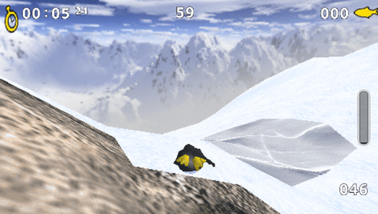

# Extreme Tux Racer for PSP

An unofficial PSP homebrew port of **Extreme Tux Racer 0.8.4**, based on the official C++ PC sources. Tested in **PPSSPP 1.20.4 at 333 MHz**, at native PSP resolution with music enabled. This codebase replaces the earlier Tux Racer 0.61 experiment.



Five seconds of gameplay captured in PPSSPP at 333 MHz. [Still screenshot](docs/images/extreme-tux-racer-psp.png).

## Downloads

[](https://github.com/chriopter/tuxracer-psp/actions/workflows/psp.yml)

Download the game ZIP, corresponding sources, and checksums from the [latest release](https://github.com/chriopter/tuxracer-psp/releases/latest). The ZIP contains `PSP/GAME/ExtremeTuxRacer/`, which you can copy to your PSP or open in PPSSPP.

Every successful push or manual build on `main` automatically publishes the next `v0.x.0` release (for example, `v0.2.0`, then `v0.3.0`), pointing to the exact commit that was built. Release notes include the commit messages since the previous version. Releases are created exclusively by CI; pushing a version tag does not start a separate build. Re-running the same CI run resumes its release instead of allocating another version. Releases become public only after all three assets have uploaded. Pull requests produce test artifacts without publishing releases.

The same files are also available under **Actions → PSP build → a successful run → Artifacts** for 30 days. Corresponding sources and license notices are uploaded together with the binary. See [package contents and rebuilding instructions](docs/binary-distribution.md).

## Building and running

Requirements: Docker, Python 3, FFmpeg, ImageMagick, and PPSSPPSDL. The SDK container image is pinned by digest.

```sh
./build-extremetuxracer.sh
python3 tools/stage-extremetuxracer.py
./start-extremetuxracer.sh
```

Optionally set `PPSSPP_BIN=/path/to/PPSSPPSDL`. The first staging run creates a separate PPSSPP profile configured for 333 MHz, 1× resolution, and no frameskip. Existing settings are preserved.

With Xvfb installed, `./start-extremetuxracer-background.sh` runs on a hidden display with audio output muted by default. Set `TUXRACER_BACKGROUND_AUDIO=1` to enable audio output in the background.

The ready-to-play directory is `state/extremetuxracer/config/ppsspp/PSP/GAME/ExtremeTuxRacer/`. It contains `EBOOT.PBP`, `data/`, and `config/`. Runtime data and compiled binaries are not committed to the repository.

## Controls

| PSP | Action | Default PC mapping in PPSSPP |
|---|---|---|
| D-pad / analog stick | Steer, navigate menus | Arrow keys / IJKL |
| Up / R | Paddle | Up / W |
| Down / L | Brake | Down / Q |
| Cross | Jump / confirm | Space |
| Circle | Back / end race | Backspace |
| Square + direction | Trick | A + direction |
| Triangle | Reset to the course | R |
| Start | Pause / resume | Enter |

## Native PSP saved data

The port uses the PSP savedata utility. **Saved data** in the main menu opens the system Save/Load dialogs, with an ETR icon. Player names can be edited with the native PSP on-screen keyboard: select the name field and press Cross; Start finishes typing. [Save dialog screenshot](docs/images/native-save.png) · [Keyboard screenshot](docs/images/native-keyboard.png).

The native profile lives at `PSP/SAVEDATA/ETRX00001PROFILE/` and contains player profiles, the selected player, unlocked cups, high scores and settings. It loads automatically at startup and saves after player selection, settings changes, completed races/cups and normal exit. Saving happens outside active racing. Existing `config/` files are imported on the first save when no native profile exists. Keep the whole savedata directory together when backing up or transferring it.

Cancelling a system dialog keeps the existing save. A damaged or unsupported native profile disables autosave and displays a warning; loading it does not replace the current working files. Use the system Save dialog to explicitly replace it, or restore a backup. The profile format includes a version, size checks and a CRC covering its header and contents.

These flows are tested in PPSSPP, including its 32 MB PSP-1000 profile. **Physical Memory Stick operation, suspend/resume and power-loss recovery still require testing on a real PSP.** See the [hardware test procedure](docs/hardware-validation.md).

## Benchmarks

Measurements record the intervals between presented frames **inside the emulated PSP**, including VSync. Loading times and the first race frame are excluded. The automated test holds paddle and steers left and right for 30 frames each per 240-frame cycle. Music and sound effects are enabled.

| PSP profile | Course | Frames | Average FPS | Steering FPS | Worst frame | Over 35 ms |
|---|---|---:|---:|---:|---:|---:|
| 32 MB | Frozen River | 2,892 | 59.940 | 59.942 | 17.626 ms | 0 |
| 32 MB | Path Of Daggers | 3,599 | 59.874 | 59.807 | 33.367 ms | 0 |
| 64 MB | Frozen River | 2,892 | 59.940 | 59.942 | 17.626 ms | 0 |
| 64 MB | Path Of Daggers | 3,599 | 59.874 | 59.807 | 33.367 ms | 0 |

The startup-fix candidate passed **26 independent emulator runs across all 22 courses**, totaling **26,160 measured frames** with music active throughout. The worst recorded interval was **33.367 ms**. These runs leave **4.18 MiB of free PSP system memory**, with a sampled game-heap peak of **12.04 MiB**. The full matrix and limitations are in the [startup validation](docs/startup-validation.md) and [raw results](docs/benchmarks/startup-stress.json). A separate clean rebuild produced the identical EBOOT.

Raw measurements and build hashes: [benchmark data](docs/benchmarks/). **These are not measurements from a physical PSP.** The emulated CPU is set to 333 MHz; this does not guarantee equivalent performance on real hardware. PSP VSync runs at approximately 59.94 Hz.

The [audio capture analysis](docs/benchmarks/audio.json) confirms a non-silent signal without clipping. Music remained active in every measured frame of those runs.

To repeat a benchmark, write a setting such as `7200 frozen_river` to `.../ExtremeTuxRacer/config/benchmark` before launching the game. The test starts automatically and writes `config/benchmark-result.json`. Remove the `benchmark` file afterward to play normally.

## Token usage for the first version

The requested first version refers to the **first bootable classic Tux Racer prototype**, before the switch to Extreme Tux Racer. Measurement period: September 7, 2026, 08:04:59–08:14:02 UTC; 44 unique model responses in the main thread.

| Metric | Tokens |
|---|---:|
| Total input, including cached input | 5,381,836 |
| Of which cached | 5,289,472 |
| Uncached input | 92,364 |
| Output, including reasoning | 14,907 |
| Total input + output | **5,396,743** |

Input includes conversation context read multiple times. Reasoning tokens are already included in output. These figures **do not represent monetary costs** or the work on the later Extreme Tux Racer port. See [scope and aggregated measurements](docs/token-usage.json); private conversation logs are not included.

## Hardware startup report

A hardware test (exact build and PSP model not yet confirmed) reported failed character, terrain and environment loading after the common textures, on firmware reported as 6.60 ME-1.3. This update removes eager loading of all ten music streams: only the playing track keeps a file open, and it closes before the next track opens. A controlled eight-handle test reproduces the same failed-loading screen with v0.3.0 sources. The fixed build reaches a race under the same limit and peaks at four held application handles. Claude independently identified the same leading cause. The actual device still needs a retest; see the [investigation and fault-injection evidence](docs/startup-validation.md).

`etr-errors.log` now records the startup firmware, working directory, memory availability and exact path/errno for resource-open/read failures. The `GL_EXT_compiled_vertex_array extension NOT supported` message refers to an optional optimization; the renderer has a standard-array fallback. Install the complete release ZIP, keeping `data/` and `config/` alongside `EBOOT.PBP`.

## Sources, changes, and limitations

The game and its data are licensed under **GPL-2.0-or-later**, with a separate permissive license for the quadtree implementation. Original author notices are preserved. All 466 game data files match the separately license-documented Debian 0.8.4 source archive byte for byte. See [licenses and provenance](docs/licensing.md), [checksums](docs/upstream.json), and the [GPL](LICENSE).

The PSP port uses single-precision math, native vertex layouts, batched snow particles, 16-bit textures, capped heightmap sizes, and PCM music. See the [porting notes](docs/porting.md) for implementation details and remaining limitations, including hardware validation limits.

```sh
python3 tools/test-etr-numerics.py
python3 tools/test-psp-save.py
python3 tools/test-psp-music.py
python3 tools/test-release.py
```

This test checks the actual numerical game sources against analytical solutions and known geometry cases. This project is not affiliated with the Extreme Tux Racer Team or Sony.
