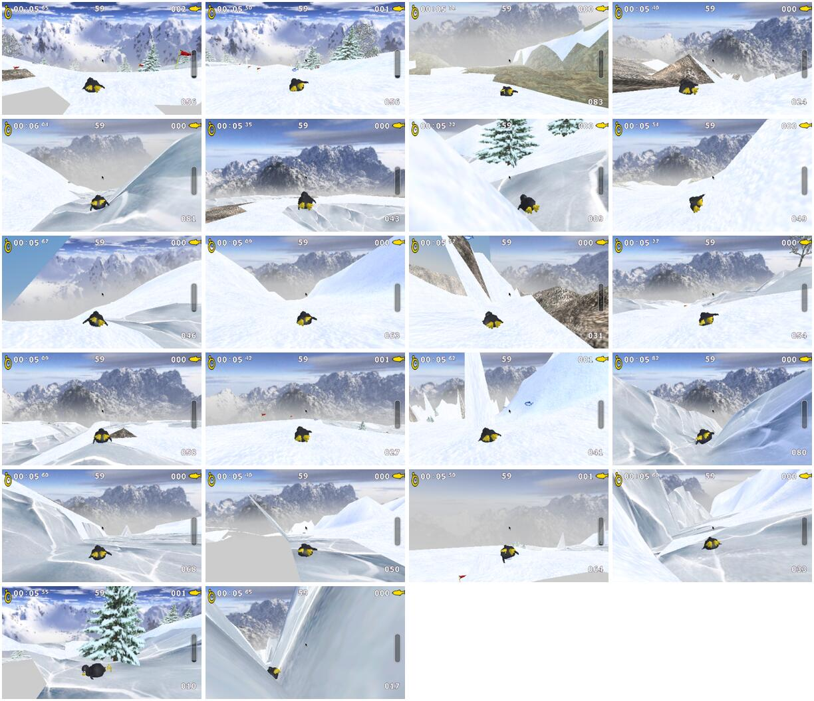
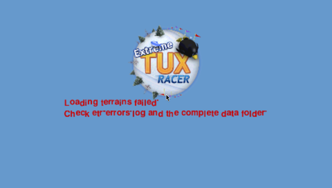

# Startup failure investigation — 2026-09-07

Physical report: an Extreme Tux Racer logo followed by failed character, terrain and environment loading; the last texture line was `data/textures/snow3.png`. Firmware was reported as 6.60 ME-1.3. The exact PSP model and installed build have not been confirmed. A passing physical-device retest is still required.

## Reproducing the failure

Two temporary PSP builds were run in PPSSPP 1.20.4 with the 32 MB model. Both linked [the same test-only wrapper](tests/psp-fd-quota.cpp), which rejects application Memory Stick opens once eight handles are held. Eight is an artificial test limit, **not a claim about the user's firmware**. The wrapper does not count filesystem operations performed internally by PSP utilities.

| Build | Result under the eight-handle limit |
| --- | --- |
| Published v0.3.0 sources, plus instrumentation | All eight slots occupied; subsequent music, character, object, terrain and environment lists cannot open. The same logo and three failed-loading messages appear. No race starts. |
| Lazy-music candidate, plus instrumentation | Peak of four held handles; all resources load and Frozen River runs with music on every measured frame. |

[Raw comparison, instrumented binary hashes and logs](benchmarks/startup-fault-injection.json). The instrumented binaries were built in `/tmp`, and are never packaged in the release. To repeat, copy `ports/extremetuxracer/psp` and `src` into a temporary tree, add `psp-fd-quota.cpp` to that tree's PSP objects and add `-Wl,--wrap=sceIoOpen,--wrap=sceIoClose` to its linker flags. Build using the same pinned Docker image as the normal port. For the baseline, use commit `8d2f60e3fade3bcca6a0e77d6d7570a9e54d8155`.

The pinned SDL_mixer source (`78cde6dd63222f9345dda38e8b7dca836aa55803`, `music.c`, `Mix_LoadMUS`) opens an SDL stream for each loaded track. The old port retained every track's stream. The fix stores filenames, closes the previous track before opening another, and retains at most one music stream. Missing theme references now resolve to null safely instead of indexing an empty music vector.

This reproduces the mechanism and demonstrates the fix under a controlled limit. Missing files on the actual Memory Stick remain another possible cause; the new immediate `RESOURCE OPEN FAILED` diagnostics distinguish missing files from exhausted handles using `errno`.

## Independent Claude review

Claude CLI independently reviewed twelve source files downloaded anonymously from the public v0.3.0 commit. It received no private workspace files or unpublished patch. It ranked retained music handles as the leading hypothesis, independently identified the unchecked music-theme lookup and missing I/O diagnostics, and flagged malformed benchmark configuration and repeated translation loading in the failure screen. Those findings were verified against the code and addressed.

Its other suggestions are not treated as hardware proof. The heap-threshold semantics had already been checked against the pinned SDK. Native utility rendering, HOME exit and suspend/resume still need physical tests. A suggested blanket utility timeout was not applied: visible save/keyboard dialogs legitimately wait for user input, and utility buffers must remain alive until shutdown completes. Existing save-codec corruption tests exercise the plaintext container; native `PROFILE.DAT` is encrypted and is checked through the PSP savedata API.

## Additional corrections and regression checks

- The music unit test runs the actual wrapper through 10,000 track switches against a one-stream backend, including failed decoding, failed playback, missing files and destruction.
- Missing all music files and invalid WAV contents are separately tested in the actual PSP EBOOT; both must reach a race without music instead of crashing.
- A missing terrain list must produce a readable failure screen and an immediate path/errno diagnostic.
- The initial sunny-course OpenGL error came from PSPGL's zero-initialized fog far plane: setting a zero start first raised `GL_INVALID_VALUE`. Setting the far plane first removes the error. The optional compiled-vertex-array extension warning does not prevent resource loading.
- Multiline text now advances to a new line consistently in rendering, bounds and cursor positioning. Translations are loaded once on splash entry rather than repeatedly after failure.
- Empty, zero and malformed benchmark files must leave normal play and native saves enabled.

Emulator guest frame intervals do not establish physical PSP CPU/GPU performance or Memory Stick latency. Course runs exercise startup and a deterministic segment; they do not prove every course finish, cup, lighting setting or lifecycle transition.

Final-candidate native regression: automatic loading restored a sentinel-replaced local profile on each malformed-benchmark boot. Manual Save cancellation returned to the save menu without changing the native file; confirmed Save updated it and displayed the native completion screen. Manual Load restored all three deliberately replaced local files byte-for-byte. [Recorded outcomes](benchmarks/startup-native-save.json), [benchmark-config cases](benchmarks/startup-benchmark-config.json), and [missing/corrupt resource cases](benchmarks/startup-resource-faults.json).

Visual sampling covers one early racing view per course, plus registration, the failure screen and native savedata dialogs. Low-resolution terrain faceting and visible transitions in reconstructed skybox faces remain quality limitations; these samples are not a claim of perfect rendering at every camera angle.

The contact sheet is an emulator spot check, ordered by course directory name. It includes visible terrain faceting and reconstructed skybox transitions.

## Final emulator matrix

All 26 runs completed with the same EBOOT (`37e9de288b6a3be4af650bca3ebd4ada862dc8d0dadec59722acaa15e2a609bd`): 22 independent ten-second course segments in the 32 MB model, followed by four longer Frozen River/Path of Daggers runs across 32 and 64 MB. Total measured frames: 26,160; average FPS range across runs: 59.840–59.940; worst interval: 33.367 ms; intervals over 35 ms: 0. Music remained active on every measured frame. No resource-open or OpenGL error was logged in those runs. [Full per-run measurements](benchmarks/startup-stress.json).

A full clean rebuild produced the same binary hash. All staged environment PNGs were checked against the 256-pixel cap; every staged music WAV was verified as 22,050 Hz mono PCM s16le. The release must still be retested on the reported physical PSP.
